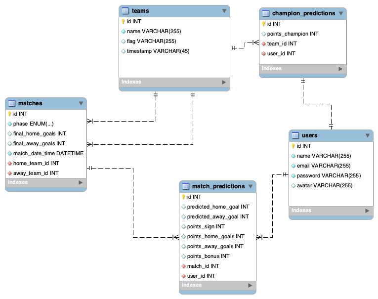
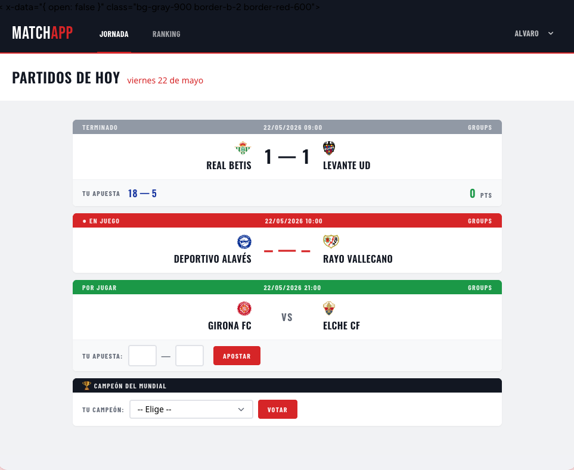
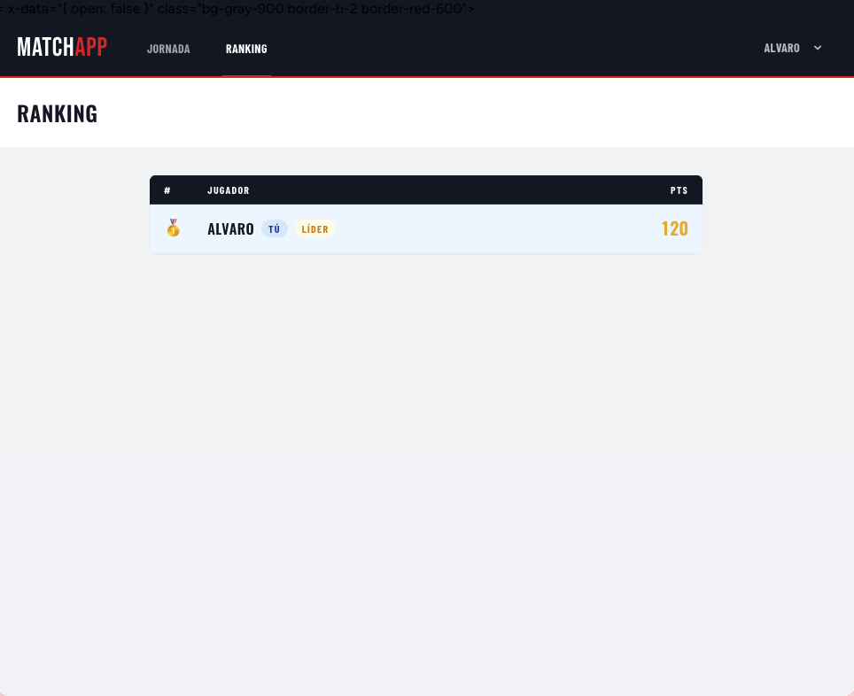
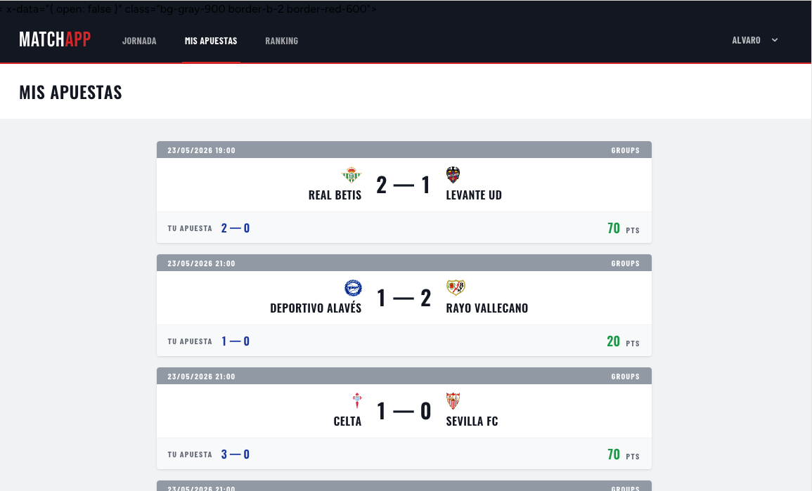

# MatchApp ⚽

Aplicación web de porra del Mundial 2026. Los usuarios predicen resultados de partidos,
acumulan puntos y compiten en un ranking general.

Proyecto desarrollado como ejercicio S4.01 del Bootcamp FullStack PHP
en IT Academy Barcelona Activa.

---

## 🛠 Tecnologías

- **Backend:** PHP 8.x · Laravel 13.8 · Eloquent ORM
- **Frontend:** Blade · Tailwind CSS
- **Base de datos:** MySQL
- **Autenticación:** Laravel Breeze
- **Herramientas:** Composer · Vite · Git

---

## ✨ Funcionalidades

- Página pública de bienvenida
- Registro, login y recuperación de contraseña con envío de email (Breeze + Mailtrap)
- Predicción de resultados de partidos (bloqueada al iniciar el partido)
- Historial personal de apuestas en partidos terminados
- Predicción del campeón del Mundial
- Cálculo automático de puntos al introducir el resultado real
- Ranking general actualizado automáticamente
- Panel de administrador: gestión de equipos, partidos y usuarios
- Página de error 404 personalizada
- Capa de Servicio para separar la lógica de negocio de los controladores

---

## 🗃 Modelo de datos

Entidades principales: `users` · `teams` · `matches` · `predictions` · `champion_predictions`



---

## 🚀 Instalación

### Requisitos previos
- PHP >= 8.2
- Composer
- Node.js >= 18
- MySQL

### Pasos

```bash
# 1. Clonar el repositorio
git clone https://github.com/aproposito/matchapp.git
cd matchapp

# 2. Instalar dependencias PHP
composer install

# 3. Instalar dependencias JS
npm install

# 4. Configurar variables de entorno
cp .env.example .env
php artisan key:generate
```

Edita `.env` con tus credenciales de base de datos:

```env
DB_DATABASE=matchapp
DB_USERNAME=root
DB_PASSWORD=
```

Para el envío de emails (recuperación de contraseña), configura también las variables `MAIL_*`.
El proyecto se ha probado con [Mailtrack](https://mailtrack.io) como servicio SMTP:

```env
MAIL_MAILER=smtp
MAIL_HOST=
MAIL_PORT=
MAIL_USERNAME=
MAIL_PASSWORD=
MAIL_FROM_ADDRESS=
```

```bash
# 5. Ejecutar migraciones y seeders
php artisan migrate --seed

# 6. Compilar assets
npm run dev

# 7. Iniciar el servidor
php artisan serve
```

Accede a `http://localhost:8000`

---

## 🧪 Cómo probarlo

### Credenciales de prueba

| Rol | Email | Contraseña |
|-----|-------|------------|
| Admin | admin@matchapp.com | password |
| Usuario | user@matchapp.com | password |

También puedes registrar un usuario nuevo desde la página de bienvenida.

### Partidos

Los seeders cargan un conjunto de partidos de ejemplo. Es probable que las fechas
no estén activas en el momento de la revisión. Para activarlos hay dos opciones:

- Modificar las fechas directamente desde el panel de administrador (perfil admin → Partidos → Editar)
- Ajustar los datos en el seeder y volver a ejecutar `php artisan migrate:fresh --seed`

---

## 🏗 Arquitectura

El proyecto sigue el patrón **MVC** con una capa de Servicio adicional:

```
app/
├── Http/
│   └── Controllers/     # Reciben la request, delegan al Service
├── Services/            # Lógica de negocio (cálculo de puntos, etc.)
└── Models/              # Eloquent ORM
```

---

## 📋 Sistema de puntuación

| Acierto | Puntos |
|---------|--------|
| Resultado (signo) | 50 |
| Goles equipo local exactos | 20 |
| Goles equipo visitante exactos | 20 |
| Bonus por cada gol > 2 en el marcador total | +5 |
| Acertar el campeón del Mundial | 150 |

---

## 📸 Capturas de pantalla

| Bienvenida | Jornada | Ranking |
|------------|---------|---------|
|  |  |  | Mis apuestas |
|  |

---

## 📝 Notas

- **Avatar de usuario:** no implementado en esta versión.
- **Gitflow:** se ha trabajado con ramas por área de desarrollo en lugar de por funcionalidad. Queda como mejora para próximas iteraciones.
- **Livewire:** no se ha utilizado en esta entrega.

---

## 👤 Autor

**Álvaro Martínez Aldama**
[LinkedIn](https://www.linkedin.com/in/alvaro-martinez-aldama/) · [GitHub](https://github.com/aproposito/)

Proyecto académico — IT Academy Barcelona Activa · Sprint 4 · 2025
